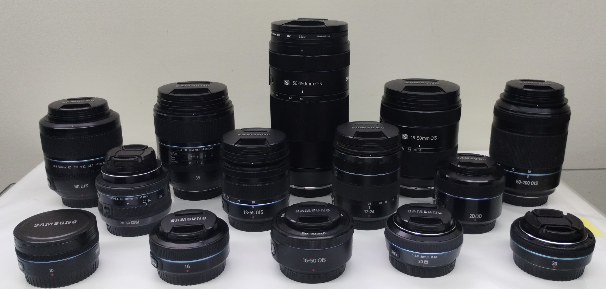

| Section |     |
| --- | --- |
| 00.xx | Introduction |
| 01.xx | Electrical and Low-Level protocol |
| 02.xx | PC Tools |
| 03.xx | General principles of the protocol |
| 04.xx | Protocol Operations |
| 05.xx | Protocol Response Codes |
| 06.xx | Protocol Event Codes |
| 07.xx | Protocol Status Codes |
| 08.xx | Protocol Status Codes |
| 09.xx | Firmware Update protocol |
| 10.xx | Experiment in designing general purpose adapter |
| 11.xx | Some data captured from lenses |

&nbsp;