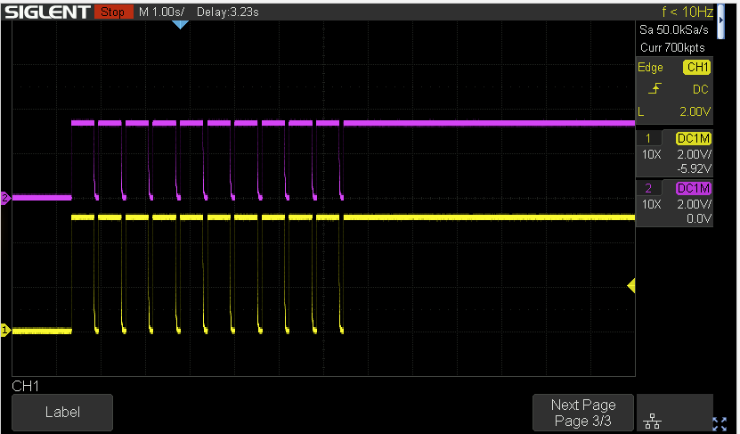
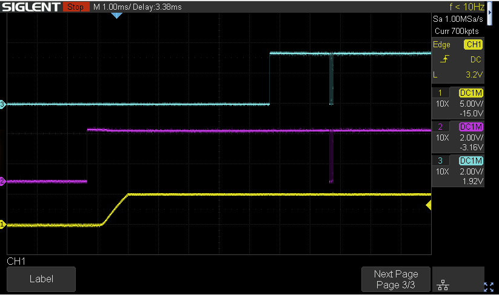
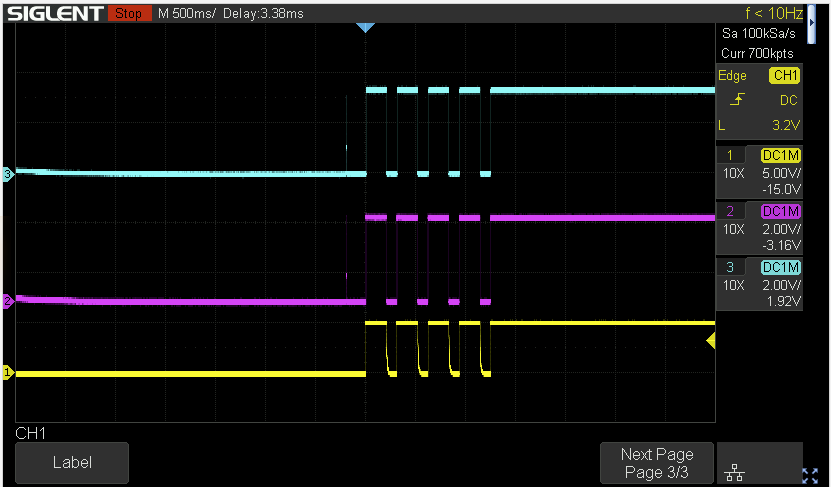

I have investigated the electrical interface between the camera and the lens using two methods:

1.  A modified a 10mm Macro Extension Tube, bringing the 8 signals out to a pin header.
2.  Modified a NX100 to bring the internal ribbon cable between the lens mount and the PCB out to pin headers.

&nbsp;

Looking into the front of the camera, with the pogo pins at the top, and numbering from left to right.

| Pin | Name | Function | Group | Breakout wire colours |
| --- | --- | --- | --- | --- |
| 1   | SPICLK | SPI Clock (3.3v) | Data | Blue |
| 2   | LENSDATA | SPI Data (3.3v) - From Lens to Body | Data | Red |
| 3   | CAMERADATA | SPI Data (3.3v) - From Body to Lens | Data | Yellow |
| 4   | CLPOLL | Body pulses it low to poll Lens | Data | White |
| 5   | LDREADY | Lens drives this low when it has data to send | Data | Black |
| 6   | GND | Ground | Power | Red + Black Mark |
| 7   | 3V3 | 3.3v (3.273v measured) | Power | Yellow + Black Mark |
| 8   | 5V  | 5v (5.088v measured) | Power | White + Black Mark |

When the lens is installed pin 8 of the lens first makes contact with pin 1 of the camera, then it rotates, wiping across pins 1-8. There is also a switch/sensor in the lower right to detect when a lens is installed.

&nbsp;

# Measurements

Using the NX100 camera, Macro Extension Tube probe (which activates the 'lens attached' switch), and 18-55mm lens.

&nbsp;

## Power On with Lens Not responding

If the lens is not installed (but some loads placed on the 3.3 and 5v lines) but 'lens attached' switch is activated -  the camera can be seen cycling the power to the lens, after which it leaves the power on. The camera has the power on for 500ms and off for 100ms.

- Pin1.SPIClk has a single high pulse just before the 5V power is <ins>removed</ins>.
- Pin4.CLPoll, Pin3.CameraData, and Pin2.LensData go high just before the 5V power is applied. This means the pullup is from the body because the lens can't be doing it at this point.
- Pin5.LDREADY stays low.

This likely means the camera is waiting for a signal on P5 from the lens.

## Power On without Lens but Pullup on Pin5

If power on the camera with the 'lens detect' switch activated, without a lens, and with a pullup on Pin5 then the camera sends the 0x03AA55 op to the lens.

When the lens doesn't respond the camera power cycles it and repeats the process up to 5 times in total before leaving the power on.

****

&nbsp;

# Lens Detection Procedure

1.  Camera is powered on
2.  Camera detects 'lens attached' signal from the mount switch.
3.  Camera applies 5V and 3.3V power to the lens
4.  Camera waits up to 500ms for lens to pull Pin5.LDReady high.
5.  Lens drives Pin5.LDReady high to indicate it's ready
6.  Camera sends 0x03AA55 op to the lens
7.  Lens drives Pin5.LDReady low, sends 0x03AA55 back to the camera, and drives Pin5 high again.
8.  Normal operation continues....

&nbsp;

# Data Comms

Bytes are sent MSB first. Data is valid on the rising clock edge.  
First byte from Master or Slave appears to be the number of bytes in the packet (including this first byte).

This corresponds with SPI Mode = 3:

- SPI CPOL =1 (idle high)
- SPI CPHA = 1 (data valid on rising edge of clk)
- Data shifted out on falling SCLK
- Data sampled on rising SCLK

&nbsp;