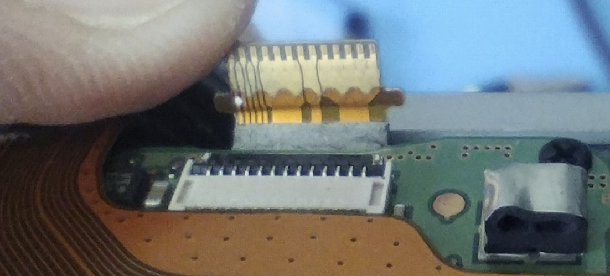
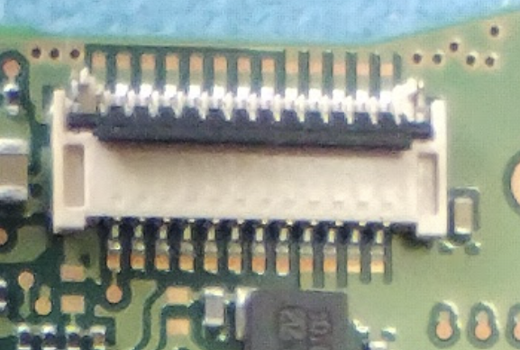

&nbsp;

Inside the NX100 the Lens contacts go to this 25way FPC ribbon.

The connector appears to be a Molex 5007972594. Although the FPC mating area more closely matches the Hirose FH23-25S-0.3SHW(05).

Should be possible to route from this connector to a ribbon that leads outside the camera.

&nbsp;

From the Left to the right

| Pin | Group |     |
| --- | --- | --- |
| 1   | A   | SPICLK |
| 2   | B   | LENSDATA |
| 3   | C   | CAMDATA |
| 4   | D   | CLPOLL |
| 5   | E   | LDREADY |
| 6   | F   | 5V  |
| 7   | F   | ^   |
| 8   | F   | ^   |
| 9   | F   | ^   |
| 10  | F   | ^   |
| 11  | F   | ^   |
| 12  | F   | ^   |
| 13  | G   | 3.3V |
| 14  | G   | ^   |
| 15  | G   | ^   |
| 16  | H   | GND |
| 17  | H   | ^   |
| 18  | H   | ^   |
| 19  | H   | ^   |
| 20  | H   | ^   |
| 21  | H   | ^   |
| 22  | H   | ^   |
| 23  | H   | ^   |
| 24  | H   | ^   |
| 25  | H   | ^   |

&nbsp;

# Disassembly

**#1 - Bottom screws**

Coarse go outside, fine go inside by the tripod mount

**#2 - Right screws**

Long at top  
Short at bottom

**#3 - Left screws**

Long at top  
Short under cover

**#4 - Battery compartment screws**

Short at front side  
Two long at rear side

**#5 - Open back cover  
**

Carefully start prising the cover apart, but only 5mm until you can see the ribbon cable and connector above (looking inside from the bottom of the case as its opened) the battery compartment.

Carefully unplug the ribbon cable. The two halves of the connector press onto each other, not 'into' like a normal FPC ribbon.

&nbsp;