## General

The communications between lens and camera is based on SPI, with the camera as master. Most of the time data comms is half duplex, either from camera to lens, or from lens to camera. Have noticed one instance, during the lenses response to op 0x1001, that the body also sends some bytes. After further investigation I think this is just junk data.

There are three basic sequences:

1.  Normal: Body sends something, lens responds
2.  Body Poll: Body polls lens, lens responds
3.  Lens Status/Event: Lens has something to send, lens sends

&nbsp;

### Normal

This sequence has the body send something to the lens, and the lens responds back.

1.  The body clocks data to the lens.
2.  The lens receives the data and handles it.
3.  The lens drives LDREADY low when it's response is ready.
4.  The body clocks data out of the lens. Using the 'byte count' fields to determine how many clocks are required, see below.
5.  The lens drives LDREADY high again when its finished.

### Body Poll

This sequence has the body poll the lens for its status.

1.  Body drives CLPoll Low
2.  Body drives CLPoll High
3.  The lens drives LDREADY low when it's response is ready.
4.  The body clocks data out of the lens.
5.  The lens drives LDREADY high again when its finished.

### Lens Status/Event

This sequence has the lens send data to the body without being requested.

1.  The lens drives LDREADY low when it wants to send data.
2.  The body clocks data out of the lens.
3.  The lens drives LDREADY high again when its finished.

&nbsp;

## Framing

Each sequence of SPI data starts with one or five bytes indicating how long the entire message is (including these bytes). If the first byte is < 0xFF then that byte N indicates that there are a total of N bytes in the transfer (N-1 bytes of data). If the first byte is 0xFF, then the next 4 bytes are a 32-bit number indicating the total number of bytes in the transfer (N-5 bytes of data).

When the lens is sending data to the camera this allows the camera to know how many bytes to read (and clocks to send).

There is not a checksum at this low level, so the structure of the sequences is free-form other than the length bytes. Some sequences do have checksums at higher layers.

Data from the lens appears to have two status bytes after the byte count. Most of the time this is 0x2001, but other values like 0x7001 are also seen.

Multi-byte values are sent MSB first.

| Byte | Length < 255 bytes | Length >= 255 bytes |
| --- | --- | --- |
| 0   | Byte count (N) | 0xFF |
| 1   | Data | Byte count (bits 24-31) |
| 2   | ... | Byte count (bits 16-23) |
| 3   | ... | Byte count (bits 8-15) |
| 4   | ... | Byte count (bits 0-7) |
| 5   | ... | Data |
| ... | ... | ... |
| N-1 | Last bytes of data | Last byte of data |

&nbsp;

# Trace Captures

The traces in the following pictures are in the table below. Note that the Pin 0-5 are on the logic channels, so they're assumed to be TTL. You will only see 0 or 1, not any floating values or analog data.

| Pin | Name |
| --- | --- |
| A1  | 5V  |
| A2  | 3.3V |
| 5   | LDREADY |
| 4   | CLPOLL |
| 3   | CAMERADATA |
| 2   | LENSDATA |
| 1   | SPICLK |
| 0   | ignore |

&nbsp;

## Camera Off

The 3V3 and 5V lines slowly decay towards 0 when the camera is turned off. Very slow, many minutes. Decay doesn't speed up when battery is removed

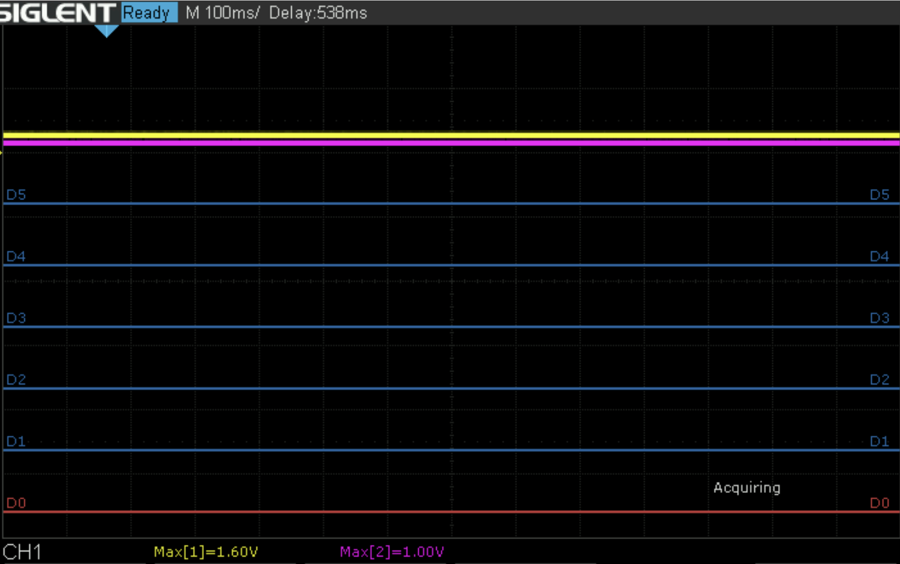

&nbsp;

## Camera Turning On with lens not fitted

10 attempts to detect the lens.

## 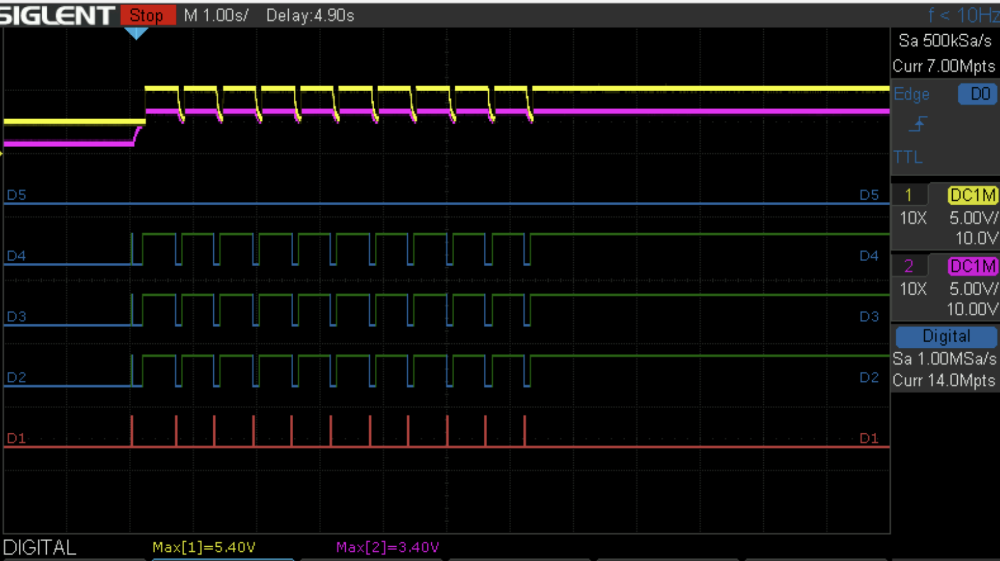

Closeup of first pulse

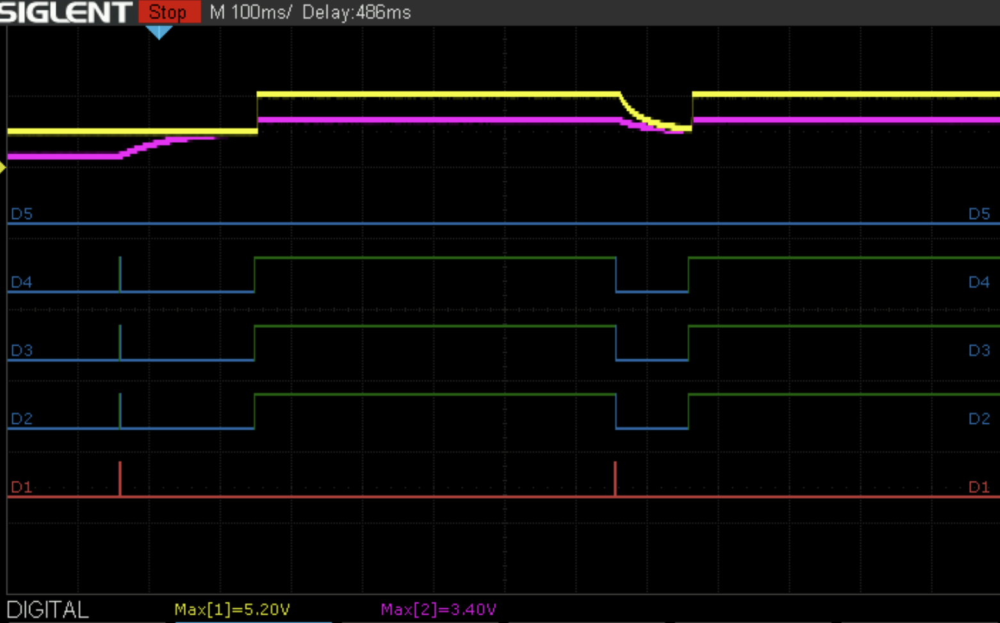

Closeup of first detection event

## 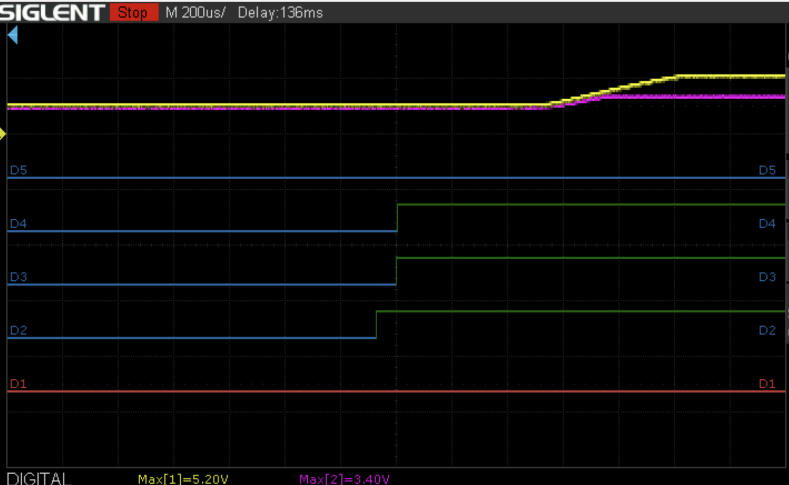

Closeup of reset attempt.

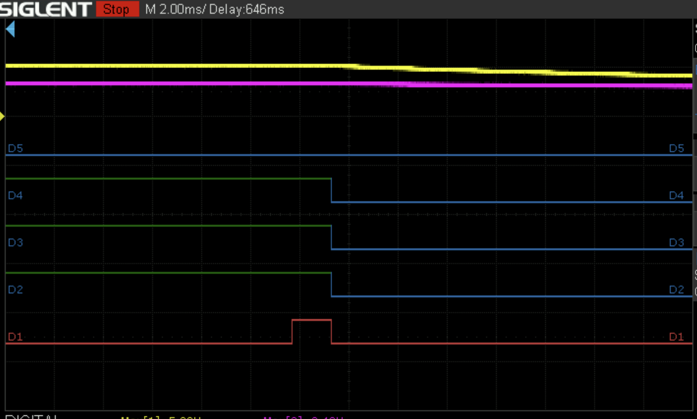

## Camera turning on with lens attached vs not attached

Not Attached

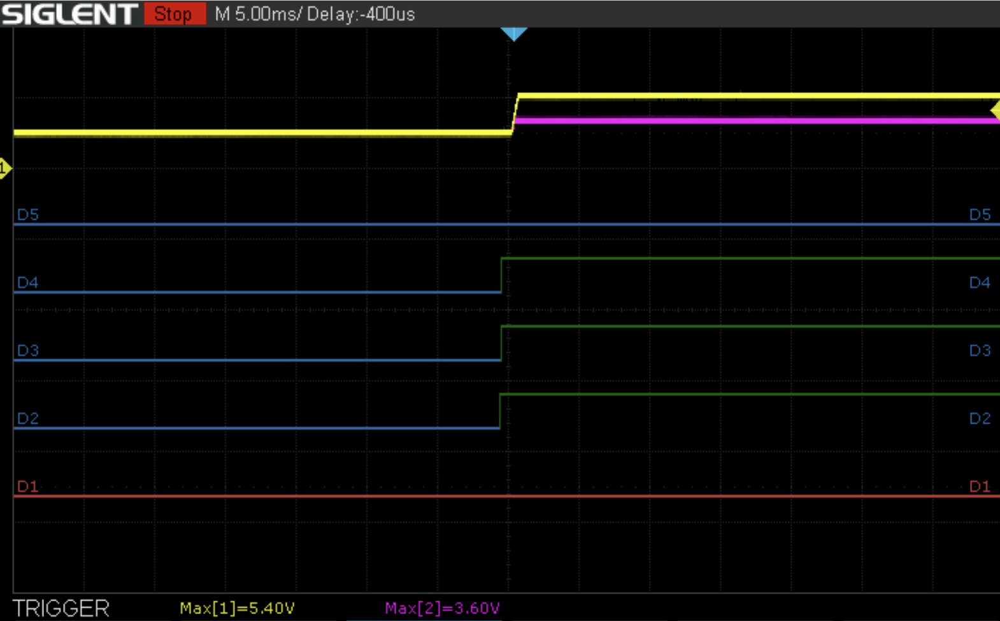

Attached

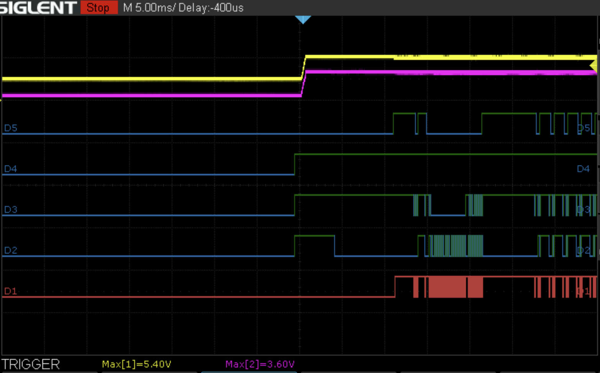

Attached - closeup

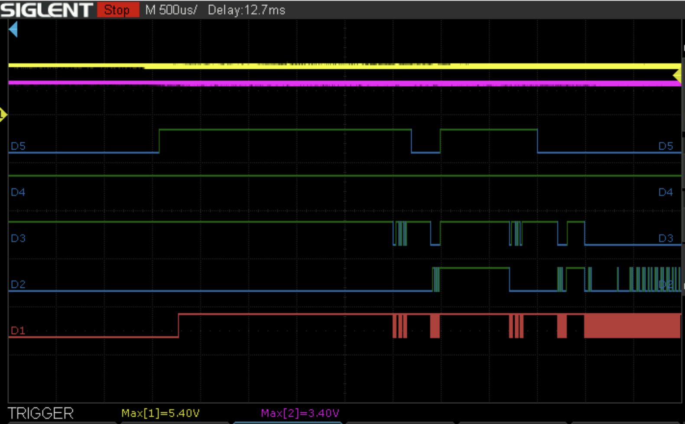

&nbsp;

## Camera with 20-50 Lens, Lens Info

Notice there is a gap in the clock when the camera decides that its going to send something to the lens while the lens is sending data to the camera. I think this is actually just junk data, can't see any structure to it.

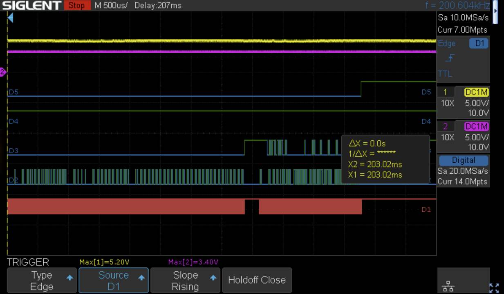

End of the lens sending data to the camera

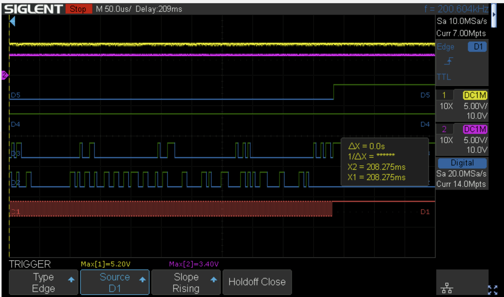

Short gap before camera starts querying the parameters from the lens.

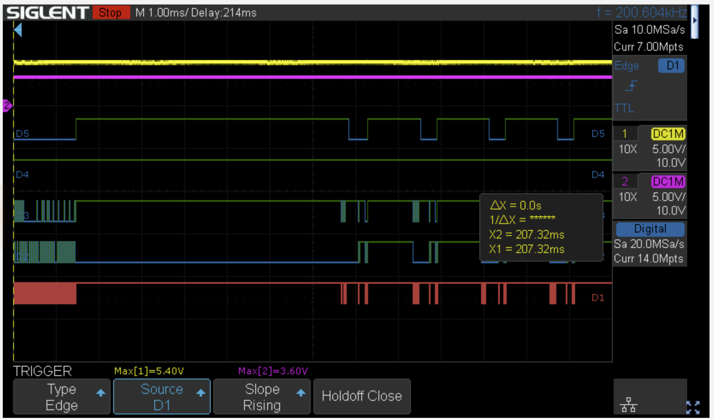

&nbsp;

&nbsp;

&nbsp;