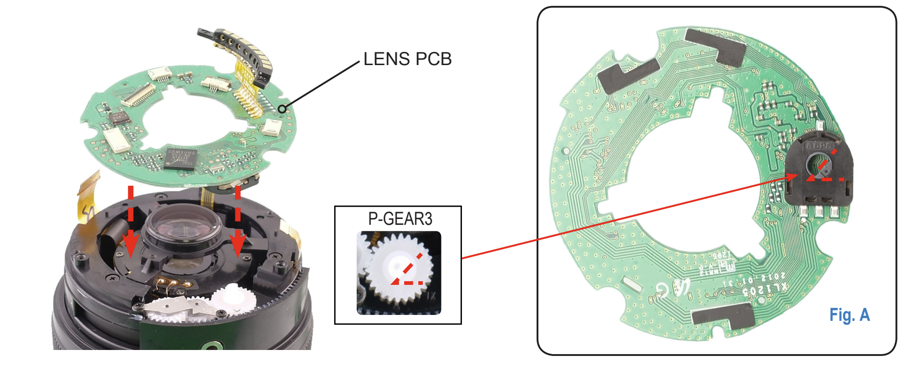

At startup the camera requests state of each Lens property using the 1006 operation, but during runtime requests properties using the 0x1007 operation. The data returned is different between 1006 and 1007 operations.

I suspect some parameters never get used with this operation, e.g. 5013 - Zoom Speed, which feels like it should be a constant, not something that changes at runtime.

&nbsp;

| Property | Description | Observed with operation 1007 |
| --- | --- | --- |
| 0x5001 | eLENS_PROPERTY_COMMUNICATION_MODE |     |
| 0x5002 | eLENS_PROPERTY_ELECTRIC_MF_PERMISSION |     |
| 0x5003 | eLENS_PROPERTY_FOCUS_MODE |     |
| 0x5004 | eLENS_PROPERTY_FOCUS_LIMIT |     |
| 0x5005 | eLENS_PROPERTY_TILT_FUNCTION |     |
| 0x5006 | eLENS_PROPERTY_SHIFT_FUNCTION |     |
| 0x5007 | eLENS_PROPERTY_FOCUS_POSITION | Y   |
| 0x5008 | eLENS_PROPERTY_ZOOM_POINT | Y   |
| 0x5009 | eLENS_PROPERTY_IRIS_POINT |     |
| 0x500A | eLENS_PROPERTY_OIS_AVAILABILITY |     |
| 0x500B | eLENS_PROPERTY_TEMPERATURE |     |
| 0x500C | eLENS_PROPERTY_ZOOM_TRACKING_PERMISSION |     |
| 0x500D | eLENS_PROPERTY_OPERATION_METHOD_PERMISSION |     |
| 0x500E | eLENS_PROPERTY_MF_RING_EVENT_PROHIBITION |     |
| 0x500F | eLENS_PROPERTY_THREE_DIM |     |
| 0x5010 | eLENS_PROPERTY_ELECTRIC_ZOOM_PERMISSION |     |
| 0x5011 | eLENS_PROPERTY_ZOOM_POINT_DT | Y   |
| 0x5012 | eLENS_PROPERTY_LENS_SHUTTER_LI_POINT |     |
| 0x5013 | eLENS_PROPERTY_ZOOM_SPEED |     |
| 0x5014 | eLENS_PROPERTY_MF_SENSITIVITY |     |
| 0x5015 | eLENS_PROPERTY_FOCUS_RANGE_ADAPT_PERMISSION |     |
| 0x5016 | eLENS_PROPERTY_FOCUS_RANGE_ADAPT_SELECT |     |
| 0x5017 | eLENS_PROPERTY_FOCUS_RANGE_ADAPT_REQUEST |     |

&nbsp;

# Support

All lenses

# Camera Request

| Byte | Function | Example |
| --- | --- | --- |
| 0   | Packet Length | 0x05 |
| 1-2 | This Code | 0x10,07 |
| 3-4 | The 50xx Code | 0x50,01 |

&nbsp;

# Lens Response

These all vary in length, but are constant across lenses.

| Byte | Function | Example |
| --- | --- | --- |
| 0   | Packet Length | 0x05 |
| 1-2 | Status Code | 0x20,01 |
| 3-N | Data | 0x07,C0 |

&nbsp;

# Notes

&nbsp;

&nbsp;

# 5001 - Communication Mode

## Support

&nbsp;

## Data

&nbsp;

## Notes

&nbsp;

# 5002 - Electric MF Permission

## Support

&nbsp;

## Data

&nbsp;

## Notes

&nbsp;

# 5003 - Focus Mode

## Support

&nbsp;

## Data

&nbsp;

## Notes

&nbsp;

# 5004 - Focus Limit

## Support

&nbsp;

## Data

&nbsp;

## Notes

&nbsp;

# 5005 - Tilt Function

## Support

&nbsp;

## Data

&nbsp;

## Notes

&nbsp;

# 5006 - Shift Function

## Support

&nbsp;

## Data

&nbsp;

## Notes

&nbsp;

# 5007 - Focus Position

## Support

All lenses

## Data

| Element | Example | Note |
| --- | --- | --- |
| 0-1 | 0x01,79 | Focus position |

## Notes

&nbsp;

&nbsp;

# 5008 - Zoom Point

## Support

All zoom lenses

## Data

Some lenses report this (type 1):

| Element | Example | Note |
| --- | --- | --- |
| 0   | 0x12 | Current Zoom Point |
| 1-2 | 0x04,3B | Current focal length in lens units. |
| 3-4 | 0x04,E8 | Minimum focal length in lens units. |
| 5-6 | 0x0F,5E | Maximum focal length in lens units. |
| 7   | 0x00 / 0x03 / 0x20 | seems to be 0x20 when the lens is reporting 'locked', 0x03 if not locked, and 0x00 if not lockable. |
|     |     |     |

Other lenses report this (type 2):

| Element | Example | Note |
| --- | --- | --- |
| 0   | 0x12 | Current Zoom Point |

## Notes

Different response on some lenses. Thought it might have been if they support the 0x5011 code that they only send the zoom point, but not the case for the 12-24mm lens.

18-55mm, 20-50mm, 50-200mm: type 1

50-150mm S, 16-50mm S, 12-24mm: type 2

Elements 1-2, 3-4, and 5-6 appear to provide a way to get the actual focal length (or perhaps just the barrel rotation) of the lens (rather than zoom points). The units the data is reported in may be calibrated per lens, or specific to the construction of the lens.

The values for elements 3-4, 5-6 are different on different instances of the same lens. E.g. on an 18-55mm, had 0x01D5 / 0F37, and on another had 0x0175 / 0EFF, so it is calibrated..

Have seen values for element 1-2 outside the range of 3-4 / 5-6 by a few counts.

&nbsp;

On the 20-50mm lens the values are almost mm/80, but this doesn't hold on the 18-55 lens. There is some hysteresis too, the transition point for zoom points is not the same if you are going up vs down.

Perhaps it's just a linear scale of rotation of the housing? On the 50-200 service manual there is a picture of whats called the 'PM Plate and Gear' and in the parts list a 'potentio_meter_assy' which makes it seem like a simple potentiometer which would just report angle rather than zoom position.

Yes, it's just a potentiometer according to the 18-55 service manual. Picture matches an ALPS Alpine RDC502012A, which is a resistive ring encoder. This would account for some of the noise in the readings. The service manual for the 12-24 which is a type 2 response also says there is a potentiometer for the zoom ring, but it appears to be a slide rather than geared system.

&nbsp;

**Type 1 Data**

| Lens | Min | Max |     |
| --- | --- | --- | --- |
| 18-55 (A) | 01D5 | 0F37 |     |
| 18-55 (B) | 0175 | 0EFF |     |
| 50-200 | 006D | 0EE4 |     |

On the 18-55: min = 01D5, max = 0F37

&nbsp;

# 5009 - Iris Point

## Support

&nbsp;

## Data

&nbsp;

## Notes

&nbsp;

# 500A - OIS Availability

## Support

&nbsp;

## Data

&nbsp;

## Notes

&nbsp;

# 500B - Temperature

## Support

&nbsp;

## Data

&nbsp;

## Notes

&nbsp;

# 500C - Zoom Tracking Permission

## Support

&nbsp;

## Data

&nbsp;

## Notes

&nbsp;

# 500D - Operating Method Permission

## Support

&nbsp;

## Data

&nbsp;

## Notes

&nbsp;

# 500E - MF Ring Event Prohibition

## Support

&nbsp;

## Data

&nbsp;

## Notes

&nbsp;

# 500F - Three Dim

## Support

&nbsp;

## Data

&nbsp;

## Notes

&nbsp;

# 5010 - Electric Zoom Permission

## Support

&nbsp;

## Data

&nbsp;

## Notes

&nbsp;

# 5011 - Zoom Point DT

## Support

The 16-50 S, 16-50 PZ, 50-150 S.

## Data

| Element | Example | Note |
| --- | --- | --- |
| 0   | 0x01 | Whole Zoom Point |
| 1   | 0x43 | Fractional Zoom Point |

## Notes

This appears to be a very fine resolution measure of the focal length / zoom. It's not just the 1-18 zoom point.

50-150 goes from 256 at zoom point 1, up to 4608 at the end of zoom point 18.

It appears to divide each zoom point into 256 parts (this looks to be defined in the 0x1006.5011). So the smallest increment past ZPDT 256 (ZP 1) goes to ZP 2 with ZPDT 257.

&nbsp;

# 5012 - Lens Shutter LI Point

## Support

&nbsp;

## Data

&nbsp;

## Notes

&nbsp;

# 5013 - Zoom Speed

## Support

&nbsp;

## Data

&nbsp;

## Notes

&nbsp;

# 5014 - MF Sensitivity

## Support

&nbsp;

## Data

&nbsp;

## Notes

&nbsp;

# 5015 - Focus Range Adapt Permission

## Support

&nbsp;

## Data

&nbsp;

## Notes

&nbsp;

# 5016 - Focus Range Adapt Select

## Support

&nbsp;

## Data

&nbsp;

## Notes

&nbsp;

# 5017 - Focus Range Adapt Request

## Support

&nbsp;

## Data

&nbsp;

## Notes